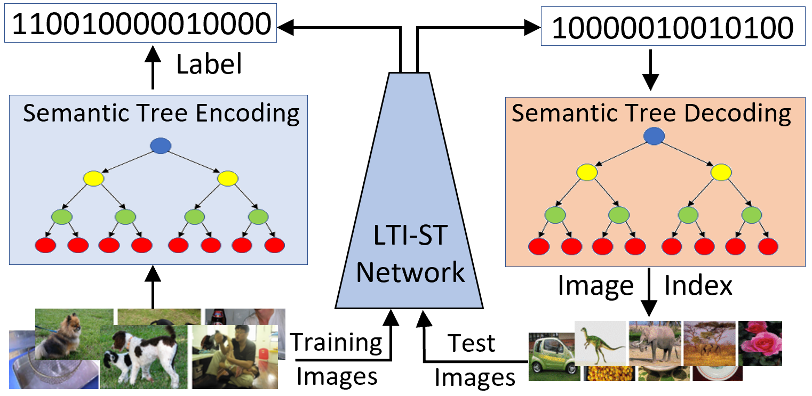
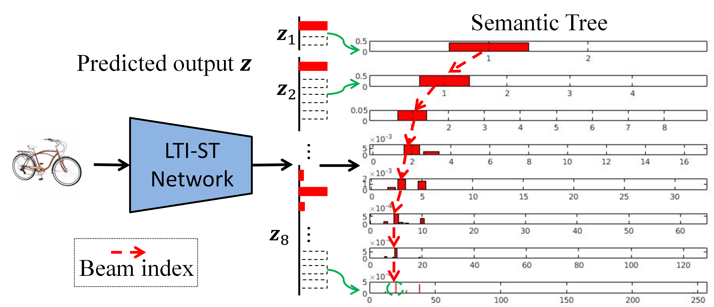

# LTI-ST
This code is mainly for understanding our TIP paper [Zero-Shot Learning to Index on Semantic Trees for Scalable Image Retrieval](https://github.com/kanshichao/LTI-ST). We will continue to maintain this project to further improve our work. Our results on the paper is implemented based on the caffe framework, because more and more people are focusing on pytorch to do their studies, this project will based on the more widely used pytorch framework to show the ideas.

 
 

### Abstract

In this study, we develop a new approach, called zero-shot learning to index on semantic trees (LTI-ST), for efficient image indexing and scalable image retrieval. Our method learns to model the inherent correlation structure between visual representations using a binary semantic tree from training images which can be effectively transferred to new test images. Based on predicted correlation structure, we construct an efficient indexing scheme for the whole test image set. Unlike existing image index methods, our proposed LTI-ST method has the following two new characteristics. First, it  does not need to analyze the test images in the query database to construct the index structure. Instead, it is directly predicted by a network learned from the training set. This zero-shot capability is critical for flexible, distributed, and scalable implementation and deployment of the image indexing and retrieval services at large scales. Second, unlike the existing distance-based index methods, our index structure is learned using the LTI-ST deep neural network with binary encoding and decoding on a hierarchical semantic tree. Our extensive experimental results on benchmark datasets and ablation studies demonstrate that the proposed LTI-ST method outperforms existing index methods by a large margin while providing the above new capabilities which are highly desirable in practice. 
